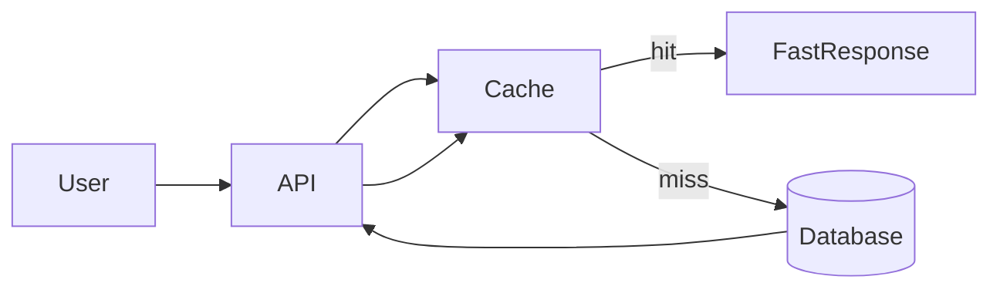

# Lesson 1: Introduction to Caching (Long-form Enhanced)

> Caching is one of the highest-leverage performance tools in real systems—but it comes with trade-offs (staleness, invalidation, and failure modes). This lesson builds the mental model you’ll use throughout the course.

## Table of Contents

- What caching is (and why it helps)
- Where caching lives (layers)
- What to cache (good vs risky candidates)
- Trade-offs and failure modes
- Best practices, pitfalls, troubleshooting
- Advanced patterns (preview): cache key design, safe fallbacks, consistency boundaries

## Learning Objectives

By the end of this lesson, you will be able to:
- Explain what caching is and why it improves performance
- Identify where caching can live in a full-stack system (browser, CDN, server, DB layer)
- Decide what kinds of data are good cache candidates
- Understand core trade-offs (staleness, invalidation, complexity, memory)
- Avoid common pitfalls (caching the wrong things, leaking private data, unbounded caches)

## Why Caching Matters

Caching stores frequently accessed data in faster storage so you don’t recompute or refetch it every time.

In real apps, caching is one of the highest-leverage performance tools because it can:
- reduce latency for users
- reduce database load
- reduce external API calls and cost

## What is Caching?

Caching is storing a copy of data (or computed results) so it can be returned faster later.

The basic idea:
- if the same request happens repeatedly
- and the result doesn’t need to be perfectly fresh every time
then caching can help.

## Why Cache?

- **Performance**: faster response times, lower tail latency
- **Reduced load**: fewer expensive DB queries
- **Cost savings**: fewer external API calls and compute cycles
- **Better UX**: faster page loads and smoother interactions

## Where Caching Happens (Cache Layers)

Caching is not just Redis.

Common layers:
- **Browser cache**: HTTP caching for static assets and responses
- **CDN cache**: edge caching (CloudFront) for static assets and sometimes API responses
- **Server in-memory cache**: fast per-instance cache (not shared)
- **Distributed cache**: shared cache across instances (Redis)

## When to Cache (Good Candidates)

Good candidates:
- frequently accessed reference data (countries list, feature flags)
- expensive computations (reports, aggregates) where slight staleness is OK
- read-heavy endpoints (product pages, public profiles)
- external API responses (with careful TTL and error handling)

Bad candidates (or cache with extra caution):
- highly personalized/private data (risk of data leakage)
- rapidly changing data requiring strict consistency
- write-heavy workloads where invalidation becomes complex

## Cache Trade-offs (The Reality)

- **Memory usage**: caches consume memory and need eviction strategies
- **Staleness**: cached data can be outdated
- **Complexity**: you must handle invalidation and cache misses safely
- **Failure modes**: cache outages should not take down your whole app

## Real-World Scenario: “Popular Products” Endpoint

If `GET /products/popular` is hit thousands of times per minute:
- caching the response for 30–120 seconds can drastically reduce DB load
- users still get “fresh enough” results

## Best Practices

### 1) Cache intentionally

Start with a known bottleneck and a clear TTL/invalidation strategy.

### 2) Cache keys should be explicit and namespaced

Example: `products:popular:v1` instead of `popular`.

### 3) Never leak private data through shared caches

If caching per-user data, include user identity in the key and avoid shared public caches.

## Common Pitfalls and Solutions

### Pitfall 1: Unbounded caches

**Problem:** cache grows forever and evicts important keys or crashes.

**Solution:** set TTLs and use eviction policies; avoid caching “infinite cardinality” keys.

### Pitfall 2: Caching without invalidation strategy

**Problem:** users see stale data and bugs appear.

**Solution:** choose TTLs deliberately and plan invalidation for writes.

### Pitfall 3: Caching sensitive data incorrectly

**Problem:** one user can see another user’s data.

**Solution:** partition keys by user/tenant and avoid shared response caching for private data.

## Troubleshooting

### Issue: Cache hit rate is low

**Symptoms:**
- performance doesn’t improve

**Solutions:**
1. Verify keys are stable (same inputs produce same key).
2. Increase TTL for stable data.
3. Ensure you’re caching at the right layer (server vs CDN vs browser).

## Next Steps

Now that you understand what caching is and why it matters:

1. ✅ **Practice**: Identify a slow endpoint and propose a caching strategy
2. ✅ **Experiment**: Add TTL-based caching and measure hit rate
3. 📖 **Next Lesson**: Learn about [Caching Concepts](./lesson-02-caching-concepts.md)
4. 💻 **Complete Exercises**: Work through [Exercises 01](./exercises-01.md)

## Advanced Patterns (Preview)

### 1) Cache key design (namespacing)

Keys should encode “what this represents” and be stable:
- include a clear prefix (`products:popular`)
- include versioning when you change formats (`v1:...`)

### 2) Fail-open vs fail-closed

If Redis is down, most product APIs should **fail open** (serve from DB, slower but correct) rather than taking the whole app down.

### 3) Consistency boundaries

Caches trade freshness for speed. Decide which endpoints can tolerate staleness and which must read from the source of truth.

## Additional Resources

- [Redis: Caching patterns](https://redis.io/docs/latest/develop/use/patterns/)
- [MDN: HTTP caching](https://developer.mozilla.org/en-US/docs/Web/HTTP/Caching)

---

**Key Takeaways:**
- Caching improves performance by avoiding repeated work and reducing DB/API load.
- Caching exists at multiple layers (browser, CDN, server, Redis).
- Trade-offs are real: staleness and invalidation require deliberate strategy.
