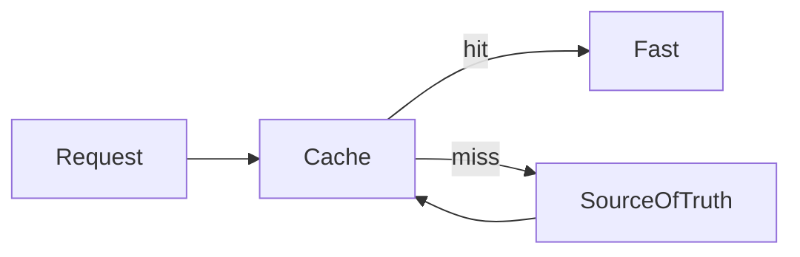

# Lesson 2: Caching Concepts (Long-form Enhanced)

> Caching failures are usually concept failures: key design, TTL trade-offs, invalidation, and what happens under load. This lesson focuses on the mental models that keep caches useful instead of flaky.

## Table of Contents

- Cache hit vs miss (and why hit rate matters)
- TTL (freshness vs performance)
- Invalidation (and why it’s hard)
- Warming and stampedes
- Best practices, pitfalls, troubleshooting
- Advanced patterns (preview): dogpile prevention, stale-while-revalidate, versioned keys

## Learning Objectives

By the end of this lesson, you will be able to:
- Explain cache hits vs misses and why hit rate matters
- Use TTLs and understand freshness vs performance trade-offs
- Understand invalidation strategies and why invalidation is hard
- Understand cache warming and when it helps (and when it hurts)
- Avoid common pitfalls (cache stampedes, flushing all keys, inconsistent key formats)

## Why These Concepts Matter

Most caching bugs come from misunderstandings about:
- when data expires
- how invalidation happens
- how the system behaves under load

Caching is easy to add, but hard to do correctly at scale.



## Cache Hit vs Cache Miss

- **Cache hit**: data found in cache (fast path)
- **Cache miss**: data not in cache (slow path: compute/fetch, then store)

### Why hit rate matters

If your hit rate is low, caching won’t help much. Common causes:
- cache keys change too often
- TTL too short
- caching the wrong layer or wrong data

## TTL (Time To Live)

TTL defines how long a key stays in cache before expiring.

```typescript
await client.setEx("key", 3600, "value"); // 1 hour TTL
```

### TTL is a trade-off

- longer TTL: better performance, more staleness risk
- shorter TTL: fresher data, lower hit rate

## Cache Invalidation

Invalidation means removing or updating cached data when the source changes.

```typescript
await client.del("key"); // Remove specific key
await client.flushAll(); // Clear all cache (use carefully!)
```

### Why invalidation is hard

When data changes, you need to know:
- which keys are affected
- when clients will see changes
- what happens if invalidation fails

### About `flushAll`

`flushAll` is almost never appropriate in production:
- it wipes everything
- causes a massive cache miss spike
- can take down your database

## Cache Warming

Cache warming pre-populates cache with data to avoid cold-start misses:

```typescript
async function warmCache() {
  const popularData = await fetchPopularData();
  await client.set("popular", JSON.stringify(popularData));
}
```

### When warming helps

- after deploys when caches are empty
- for “top N” endpoints that are hit immediately

### When warming hurts

- if you warm too many keys and overload DB
- if you warm data that isn’t actually used

## Cache Stampede (Common Failure Mode)

If a popular key expires, many requests can miss at once and hammer the DB.

Mitigations (conceptual):
- add jitter to TTLs
- use “single flight” / locking per key
- serve stale while revalidating (advanced pattern)

## Real-World Scenario: Product Page Cache

If product data updates occasionally:
- cache by product ID with TTL (e.g., 60–300s)
- invalidate on product update events
- consider stampede protection for very popular products

## Best Practices

### 1) Use consistent key naming

Namespace keys:
- `product:123:v1`
- `users:list:page=1:limit=20:v2`

### 2) Avoid global flushes

Prefer targeted deletes or versioned keys.

### 3) Measure hit rate and latency

Caching without measurement is guesswork.

## Common Pitfalls and Solutions

### Pitfall 1: Too-short TTL

**Problem:** low hit rate, little performance gain.

**Solution:** increase TTL for stable data and measure results.

### Pitfall 2: Wrong invalidation scope

**Problem:** stale data persists after writes.

**Solution:** define exactly which keys depend on which records and invalidate accordingly.

### Pitfall 3: Cache stampede

**Problem:** spikes in DB load when popular keys expire.

**Solution:** add TTL jitter and consider per-key locking/stale-while-revalidate.

## Troubleshooting

### Issue: Cache appears “not to work”

**Symptoms:**
- always hitting DB

**Solutions:**
1. Confirm you’re using the same key for the same request.
2. Confirm TTL isn’t expiring too quickly.
3. Confirm cached values are being serialized/deserialized correctly.

## Advanced Patterns (Preview)

### 1) TTL jitter (reduce stampedes)

Add small randomness to TTLs so many keys don’t expire at the same second.

### 2) Stale-while-revalidate (concept)

Serve slightly stale data while refreshing in the background. This reduces tail latency and avoids stampedes for hot keys.

### 3) Versioned keys as “cheap invalidation”

Instead of deleting many keys, bump a version prefix (e.g., `v2:products:...`) when formats or logic change.

## Next Steps

Now that you understand core caching concepts:

1. ✅ **Practice**: Add TTL-based caching to one endpoint and measure hit rate
2. ✅ **Experiment**: Add key versioning to simplify invalidation
3. 📖 **Next Lesson**: Learn about [Cache Types](./lesson-03-cache-types.md)
4. 💻 **Complete Exercises**: Work through [Exercises 01](./exercises-01.md)

## Additional Resources

- [Redis: Key expiration](https://redis.io/docs/latest/develop/use/keyspace/)

---

**Key Takeaways:**
- Cache hits are the goal; hit rate determines effectiveness.
- TTL balances freshness vs performance.
- Invalidation is hard—avoid `flushAll` and prefer targeted deletes or versioning.
- Plan for stampedes when popular keys expire.
