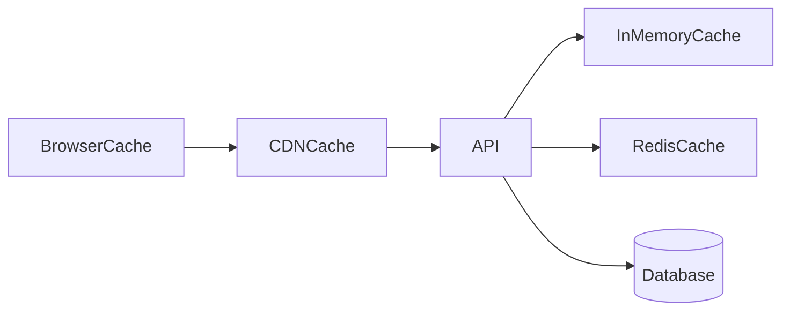

# Lesson 3: Cache Types (Long-form Enhanced)

> Where you cache determines everything: who benefits, how consistent it is, and how invalidation works. This lesson compares browser/CDN caches, in-memory caches, and distributed caches like Redis.

## Table of Contents

- Cache layers and who benefits
- In-memory cache (per-instance)
- Distributed cache (Redis)
- Client-side caches (browser/CDN) conceptually
- Picking the right cache type
- Best practices, pitfalls, troubleshooting
- Advanced patterns (preview): hybrid strategies, cache coherence, avoiding leakage

## Learning Objectives

By the end of this lesson, you will be able to:
- Compare application (in-memory) caching vs distributed caching (Redis)
- Understand client-side caches (browser/CDN) at a conceptual level
- Identify which cache type fits which problem (latency, scale, consistency)
- Implement a simple cache-aside flow safely
- Avoid common pitfalls (per-instance inconsistency, caching private data in shared caches, unbounded memory caches)

## Why Cache Types Matter

Not all caches are the same.
Where you cache determines:
- who benefits (one user vs everyone)
- what consistency guarantees exist
- how invalidation works



## Application-Level Cache (In-Memory)

Cache within your application process:

```typescript
const cache = new Map<string, any>();

function getCached(key: string) {
  if (cache.has(key)) {
    return cache.get(key);
  }
  // Fetch and cache
}
```

### Pros

- extremely fast
- simple to implement
- no external dependency

### Cons

- not shared across servers/processes
- cache clears on restart/deploy
- memory can grow without bounds unless you add eviction

Use this when:
- single instance app
- small, bounded data
- short-lived caching for per-request optimizations

## Distributed Cache (Shared Cache)

A shared cache across servers (Redis):

```typescript
// All servers share the same Redis instance
await redisClient.set("key", "value");
```

### Pros

- shared across instances (works with horizontal scaling)
- can store more data than a single process
- supports TTL and eviction policies

### Cons

- network hop (slower than in-memory)
- requires operating Redis (availability, monitoring)
- adds failure modes (Redis down, slow, misconfigured)

Use this when:
- multiple API instances
- shared hot data
- you need TTL and centralized invalidation

## Browser and CDN Caches (Client/Edge)

While this course focuses on server/Redis caching, remember:
- browsers cache static assets and some responses via HTTP headers
- CDNs cache static assets and can reduce global latency

These caches can provide huge performance wins for:
- images
- JS/CSS bundles
- public pages that can be cached safely

## Cache-Aside Pattern (Most Common)

Application manages cache:

```typescript
async function getData(id: string) {
  // 1) Check cache
  const cached = await redis.get(`data:${id}`);
  if (cached) return JSON.parse(cached);

  // 2) Fetch from database (source of truth)
  const data = await db.findById(id);

  // 3) Store in cache (with TTL)
  await redis.setEx(`data:${id}`, 3600, JSON.stringify(data));

  return data;
}
```

### What can go wrong

- stampede on popular key expiration
- stale values if invalidation doesn’t happen
- caching error responses or nulls incorrectly

We’ll cover strategies for these in later levels.

## Real-World Scenario: Profile Page

For `GET /users/:id`:
- in-memory cache can help on a single instance
- distributed cache helps when you have multiple instances
- CDN/browser caching can help only if the data is public and safe to cache

## Best Practices

### 1) Pick cache types based on your architecture

Single instance: in-memory may be enough.  
Multi-instance: distributed caching becomes more valuable.

### 2) Bound your caches

Always plan eviction and TTLs to prevent memory leaks.

### 3) Keep private data safe

If caching per-user data, key it by user identity and avoid edge caching unless carefully configured.

## Common Pitfalls and Solutions

### Pitfall 1: In-memory cache inconsistency across instances

**Problem:** different servers have different cached values.

**Solution:** use Redis for shared caching (or accept eventual consistency intentionally).

### Pitfall 2: Unbounded in-memory caching

**Problem:** process memory grows until crash.

**Solution:** implement TTL/eviction or restrict what you cache.

### Pitfall 3: Caching private responses at the CDN

**Problem:** data leaks between users.

**Solution:** never cache private data publicly; use `Cache-Control` correctly.

## Troubleshooting

### Issue: Caching makes behavior “weird”

**Symptoms:**
- stale values after updates

**Solutions:**
1. Ensure invalidation happens on writes.
2. Reduce TTL to limit staleness until invalidation is correct.
3. Use versioned keys when invalidation is hard.

## Advanced Patterns (Preview)

### 1) Hybrid strategies (multi-layer caching)

A common real setup is layered:
- CDN for static assets
- server-side Redis for shared responses
- small in-memory caches for per-process hot data

### 2) Cache coherence (concept)

The more caches you add, the harder it is to keep them consistent. Prefer fewer, well-defined caches with clear invalidation rules.

### 3) Avoiding data leakage as a design constraint

If there’s any chance a response is user-specific, treat it as private by default (or include user/tenant in the key).

## Next Steps

Now that you understand cache types:

1. ✅ **Practice**: Decide which cache layer fits each endpoint (public pages vs private data)
2. ✅ **Experiment**: Implement cache-aside for one endpoint with a safe TTL
3. 📖 **Next Level**: Move into Redis basics
4. 💻 **Complete Exercises**: Work through [Exercises 01](./exercises-01.md)

## Additional Resources

- [MDN: Cache-Control](https://developer.mozilla.org/en-US/docs/Web/HTTP/Headers/Cache-Control)

---

**Key Takeaways:**
- In-memory caches are fastest but per-instance; Redis is shared but adds network + ops complexity.
- Browser/CDN caches can be huge wins for public/static content.
- Cache-aside is common, but requires careful TTL/invalidation design.
