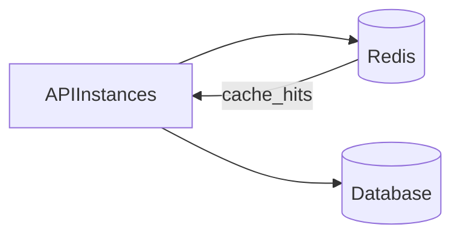

# Lesson 1: Redis Introduction (Long-form Enhanced)

> Redis is the most common shared cache and fast state store in production systems. This lesson focuses on what Redis is good at, what it’s risky for, and the operational trade-offs that matter.

## Table of Contents

- Redis mental model (in-memory + data structures)
- Common use cases (beyond caching)
- Redis vs database (source of truth)
- Operational trade-offs (memory/eviction/persistence)
- Best practices, pitfalls, troubleshooting
- Advanced patterns (preview): clustering, persistence strategy, key hygiene

## Learning Objectives

By the end of this lesson, you will be able to:
- Explain what Redis is and why it’s commonly used for caching
- Understand Redis’s core characteristics (in-memory, optional persistence, data structures)
- Identify common Redis use cases beyond caching (sessions, rate limiting, queues, pub/sub)
- Understand key operational trade-offs (memory limits, eviction, persistence modes)
- Connect to Redis from Node.js at a basic level

## Why Redis Matters

Redis is one of the most common building blocks in production systems because it provides:
- **very fast reads/writes** (memory-backed)
- **shared state** across multiple app instances
- **useful primitives** (TTL, atomic increments, sets, lists)

This makes it ideal for:
- caching hot reads
- rate limiting
- session storage
- lightweight queues



## What is Redis?

Redis (Remote Dictionary Server) is an in-memory data structure store.

Think of it as:
- a key/value store
- with powerful data structures
- and features like TTL and atomic operations

## Redis Features

- **In-memory**: extremely fast for hot data
- **Data structures**: strings, hashes, lists, sets, sorted sets (and more)
- **TTL and eviction**: expires keys and evicts under memory pressure
- **Persistence (optional)**: can write snapshots/logs to disk (trade-offs)
- **Pub/Sub**: publish-subscribe messaging (not durable like a queue)

## Redis Use Cases (Common Patterns)

- **Caching**: store computed results or hot DB reads
- **Session storage**: store session tokens/state (common for server-side sessions)
- **Rate limiting**: atomic counters with TTL windows
- **Real-time analytics**: counters, unique sets, leaderboards
- **Queues**: lists/streams for background work (depends on requirements)

## Redis vs Database (Mental Model)

Databases are typically:
- durable source of truth
- optimized for querying and constraints

Redis is typically:
- fast ephemeral/shared state
- not the long-term source of truth for critical data (unless designed that way)

## Operational Trade-offs (What to Keep in Mind)

- **Memory is finite**: you need eviction/TTLs for many workloads
- **Staleness**: caching introduces stale reads unless invalidation is correct
- **Persistence choices**: enabling persistence improves durability but changes performance characteristics
- **Single-threaded core**: Redis is fast but you still need to avoid expensive operations on huge keys

## Connecting to Redis (Node.js)

```typescript
import { createClient } from "redis";

const client = createClient({
  url: "redis://localhost:6379",
});

await client.connect();
```

### Connection best practices (preview)

- connect once (singleton per process) and reuse the client
- handle connection errors and reconnect behavior
- don’t create a new client per request

We’ll cover connection management in the Node Redis integration level.

## Real-World Scenario: Rate Limiting Login Attempts

Redis can store a counter per IP/user:
- increment on each login attempt
- set a TTL window (e.g., 10 minutes)
- block if threshold exceeded

This is hard to implement safely with only an in-memory per-server cache.

## Best Practices

### 1) Use TTLs intentionally

If data can expire safely, set TTLs so Redis doesn’t grow without bounds.

### 2) Keep keys namespaced

Examples:
- `user:123:profile:v1`
- `rate_limit:login:ip:1.2.3.4`

### 3) Treat Redis as a dependency that can fail

Design fallbacks:
- cache miss fallback to DB
- fail-open vs fail-closed decisions (especially for rate limiting)

## Common Pitfalls and Solutions

### Pitfall 1: Treating Redis as the source of truth accidentally

**Problem:** data disappears on restart/eviction and your app breaks.

**Solution:** keep authoritative data in your DB and use Redis as a cache/accelerator.

### Pitfall 2: No TTLs or eviction planning

**Problem:** memory grows until keys are evicted unpredictably or Redis crashes.

**Solution:** use TTLs and choose appropriate eviction policies.

### Pitfall 3: Creating a Redis connection per request

**Problem:** connection explosion and poor performance.

**Solution:** create a singleton client per app process.

## Troubleshooting

### Issue: App can’t connect to Redis

**Symptoms:**
- connection refused/timeouts

**Solutions:**
1. Confirm Redis is running and reachable (`localhost:6379`).
2. Confirm URL and credentials (if using auth).
3. Check container networking if Redis runs in Docker.

## Advanced Patterns (Preview)

### 1) Persistence strategy (concept)

Redis can persist data (RDB/AOF), but that changes failure modes and performance characteristics. Decide based on what data you’re storing.

### 2) Key hygiene (namespaces + TTL)

Treat key naming as an API:
- use prefixes (`session:`, `rate:`, `cache:`)
- avoid collisions
- apply TTLs for ephemeral data

### 3) Cluster vs single node

Many apps start with a single Redis instance. At scale, clustering/replication becomes relevant (but adds complexity).

## Next Steps

Now that you understand Redis at a high level:

1. ✅ **Practice**: Connect to Redis and set/get a key
2. ✅ **Experiment**: Add TTL and verify expiration behavior
3. 📖 **Next Lesson**: Learn about [Redis Commands](./lesson-02-redis-commands.md)
4. 💻 **Complete Exercises**: Work through [Exercises 02](./exercises-02.md)

## Additional Resources

- [Redis Docs](https://redis.io/docs/latest/)

---

**Key Takeaways:**
- Redis is an in-memory data structure store used for caching and shared state.
- TTLs/eviction and failure modes are core parts of Redis design.
- Use Redis for speed and coordination, not as accidental long-term source of truth.
