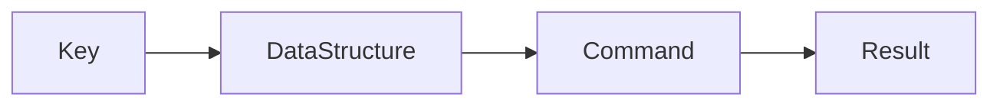

# Lesson 2: Redis Commands (Long-form Enhanced)

> Redis performance depends on using the right command on the right structure. This lesson focuses on core commands you’ll use for caching, and the mistakes that cause correctness bugs and slowdowns at scale.

## Table of Contents

- Strings vs hashes (when to use each)
- TTLs and safe deletion
- “Expensive” operations and bounded data
- Key naming and collisions
- Best practices, pitfalls, troubleshooting
- Advanced patterns (preview): pipelining, Lua scripts, avoiding large-key traps

## Learning Objectives

By the end of this lesson, you will be able to:
- Use core Redis commands through the Node Redis client
- Understand when to use strings vs hashes vs lists vs sets
- Set TTLs and delete keys safely
- Recognize commands that can become expensive on large keys
- Avoid common pitfalls (key collisions, missing TTLs, using the wrong structure)

## Why Commands Matter

Redis performance and correctness depend heavily on:
- choosing the right data structure
- choosing the right command
- naming keys consistently

“Working” Redis code can still fail at scale if you use the wrong operations on large datasets.



## String Operations

Strings are the simplest Redis value type: key → string.

```typescript
await client.set("key", "value");
const value = await client.get("key");

await client.del("key");

// Set with TTL (seconds)
await client.setEx("key", 3600, "value");
```

### When strings are good

- cached JSON payloads (stringified)
- counters (with `INCR`-style commands; covered conceptually)
- small values with TTL

## Hash Operations

Hashes store “object-like” fields under one key.

```typescript
await client.hSet("user:1", { name: "Alice", email: "alice@example.com" });

const user = await client.hGetAll("user:1");
const name = await client.hGet("user:1", "name");
```

### Why hashes are useful

- update one field without rewriting a full JSON blob
- keep related fields together

## List Operations

Lists are ordered sequences (like a queue/stack).

```typescript
await client.lPush("list", "item1"); // push left
await client.rPush("list", "item2"); // push right

const items = await client.lRange("list", 0, -1); // read range
```

### When lists are good

- simple queues
- recent activity feeds (bounded length with trimming in advanced setups)

## Set Operations

Sets store unique members (no duplicates).

```typescript
await client.sAdd("set", "member1", "member2");

const members = await client.sMembers("set");
const isMember = await client.sIsMember("set", "member1"); // true
```

### When sets are good

- unique tags
- “has user seen this?” membership checks
- deduplication of IDs

## TTL and Deletion (Safety Notes)

TTL is critical for caches:
- it bounds memory growth
- limits staleness

Deletion should be targeted:
- `del(key)` for specific keys
- avoid global clears in production (e.g., `flushAll`)

## Key Naming (Practical Convention)

Use namespaced keys:
- `user:1`
- `user:1:profile`
- `rate_limit:login:ip:1.2.3.4`

Add versions when payload shape might change:
- `user:1:v1`

## Real-World Scenario: Caching User Profiles

Two common approaches:
- store full JSON in a string key (`user:1:profile`)
- store fields in a hash (`user:1:profile`) if you update them independently

Both work—trade-offs depend on update frequency and payload size.

## Best Practices

### 1) Pick the data structure that matches your access pattern

If you need membership checks: sets.  
If you need ordered items: lists.  
If you need field updates: hashes.  

### 2) Bound caches with TTLs

Default to adding TTLs to cache keys unless you have a reason not to.

### 3) Avoid expensive patterns on huge keys

Commands like “get all members” can be expensive if the key is huge.
Design with bounded sizes and pagination when needed (advanced topic).

## Common Pitfalls and Solutions

### Pitfall 1: Using one key for multiple meanings

**Problem:** key collisions (`user:1` used as string and hash).

**Solution:** namespace keys and keep types consistent.

### Pitfall 2: No TTLs

**Problem:** cache grows until eviction or memory pressure.

**Solution:** use `setEx` or `expire` patterns for cache entries.

### Pitfall 3: Fetching huge collections

**Problem:** `SMEMBERS`/`LRANGE 0 -1` becomes heavy at scale.

**Solution:** keep keys bounded; use range reads and pagination strategies.

## Troubleshooting

### Issue: “WRONGTYPE Operation against a key holding the wrong kind of value”

**Symptoms:**
- you try `HGET` on a string key or `GET` on a hash key

**Solutions:**
1. Ensure keys are not reused across different types.
2. Adopt consistent naming conventions by type.

## Advanced Patterns (Preview)

### 1) Pipelining (reduce round trips)

Batch commands to reduce latency when you need multiple operations per request.

### 2) Lua scripts (atomic multi-step ops) (concept)

For complex multi-step updates, Lua scripts can keep operations atomic and consistent (advanced).

### 3) Large-key traps

Avoid operations that read “everything” (`LRANGE 0 -1`, `SMEMBERS`) on unbounded keys—design bounded collections instead.

## Next Steps

Now that you can use core commands:

1. ✅ **Practice**: Implement a cache key with TTL and verify it expires
2. ✅ **Experiment**: Use hashes for field updates vs strings for whole JSON
3. 📖 **Next Lesson**: Learn about [Redis Data Structures](./lesson-03-data-structures.md)
4. 💻 **Complete Exercises**: Work through [Exercises 02](./exercises-02.md)

## Additional Resources

- [Redis command reference](https://redis.io/commands/)

---

**Key Takeaways:**
- Redis command choice depends on data structure and access pattern.
- Use TTLs and targeted deletes to keep caches safe and bounded.
- Keep key naming consistent to avoid WRONGTYPE errors and collisions.
