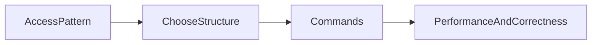

# Lesson 3: Redis Data Structures (Long-form Enhanced)

> Redis is powerful because it offers data structures, not just “a string cache”. This lesson focuses on mapping access patterns (lookup, uniqueness, ordering, ranking) to the right structure.

## Table of Contents

- Choosing structures by access pattern
- Strings vs hashes (object modeling)
- Lists/sets/sorted sets (queues, membership, leaderboards)
- Trade-offs (memory, cardinality, expensive ops)
- Best practices, pitfalls, troubleshooting
- Advanced patterns (preview): streams, bounded collections, rank/query design

## Learning Objectives

By the end of this lesson, you will be able to:
- Understand Redis’s most common data structures (strings, hashes, lists, sets, sorted sets)
- Choose the right structure based on access patterns (lookup, ordering, uniqueness, ranking)
- Model practical use cases (profiles, queues, tags, leaderboards)
- Understand trade-offs (memory, cardinality, expensive operations)
- Avoid common pitfalls (unbounded lists/sets, wrong structure choice, mixing types per key)

## Why Data Structures Matter

Redis is powerful because it’s not just “string cache”.
Its data structures let you model common backend problems efficiently:
- counters
- membership checks
- ordered collections
- rankings

Choosing the right structure is often the difference between:
- fast and reliable
- slow and unbounded



## Strings

Strings are simple key-value:

```typescript
await client.set("user:1:name", "Alice");
```

Use strings for:
- cached JSON blobs
- small scalar values
- counters (via atomic increment commands)

## Hashes

Hashes store object-like fields:

```typescript
await client.hSet("user:1", {
  name: "Alice",
  email: "alice@example.com",
  age: "25",
});
```

Use hashes when:
- you want to update individual fields
- you want “one key per object”

## Lists

Lists are ordered collections:

```typescript
await client.lPush("tasks", "task1", "task2");
```

Use lists for:
- simple queues
- recent items

### Beware unbounded lists

If you push forever, lists can grow without bound. Production systems often:
- set TTLs
- trim lists to a max length (advanced)

## Sets

Sets are unique collections:

```typescript
await client.sAdd("tags", "javascript", "typescript");
```

Use sets for:
- tags
- unique IDs
- membership checks (“has user done X?”)

## Sorted Sets

Sorted sets store unique members with scores (ranking):

```typescript
await client.zAdd("leaderboard", {
  score: 100,
  value: "player1",
});
```

Use sorted sets for:
- leaderboards
- ranked lists
- time-ordered feeds (score = timestamp)

## Real-World Scenario: Feature Flags and Rate Limits

Common mappings:
- feature flags: hash (`flags:env`) where each field is a flag name
- rate limits: string counters with TTL per key (`rl:login:ip:...`)
- leaderboards: sorted sets by score

## Best Practices

### 1) Design keys around access patterns

Start with the question: “What reads/writes do I need to be fast?”

### 2) Bound collection growth

Lists/sets/sorted sets can become huge—use TTLs, trimming, or per-user partitioning.

### 3) Never mix types under the same key

If `user:1` is a hash, don’t later store it as a string.

## Common Pitfalls and Solutions

### Pitfall 1: Unbounded collections

**Problem:** memory growth and slow operations on huge keys.

**Solution:** TTLs, trimming, and careful key design.

### Pitfall 2: Choosing the wrong structure

**Problem:** you need membership checks but use lists, leading to slow scans.

**Solution:** use sets for membership.

### Pitfall 3: WRONGTYPE errors

**Problem:** calling hash commands on string keys.

**Solution:** consistent naming + consistent type usage per key.

## Troubleshooting

### Issue: Operations become slow over time

**Symptoms:**
- commands that were fast become slow as data grows

**Solutions:**
1. Measure key sizes/cardinality.
2. Bound growth (TTL/trim) and redesign keys if necessary.
3. Avoid “read everything” operations on huge keys.

## Advanced Patterns (Preview)

### 1) Bounded collections as a rule

Use TTLs, trimming, or max sizes so lists/sets don’t grow forever.

### 2) Redis Streams (concept)

Streams can model durable-ish event processing better than lists in some use cases (advanced).

### 3) Rank/query design for sorted sets

Sorted sets shine for leaderboards and ranking queries—design keys and ranges intentionally to avoid expensive scans.

## Next Steps

Now that you understand core Redis structures:

1. ✅ **Practice**: Choose the best structure for 3 features (cache, rate limit, leaderboard)
2. ✅ **Experiment**: Implement one feature using the chosen structure and test behavior under load
3. 📖 **Next Level**: Move into Node Redis integration
4. 💻 **Complete Exercises**: Work through [Exercises 02](./exercises-02.md)

## Additional Resources

- [Redis Data Types](https://redis.io/docs/latest/develop/data-types/)

---

**Key Takeaways:**
- Redis data structures map to access patterns: strings (simple), hashes (fields), lists (ordered), sets (unique), sorted sets (ranked).
- Bound collection growth to avoid memory/performance issues.
- Keep key types consistent to avoid WRONGTYPE errors.
