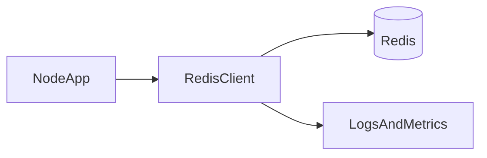

# Lesson 1: node-redis Setup (Long-form Enhanced)

> Knowing Redis commands isn’t enough—reliability comes from stable connections, error handling, and sane fallback behavior. This lesson focuses on getting `redis` (node-redis) wired correctly in a TypeScript app.

## Table of Contents

- Installing node-redis
- Connecting via `REDIS_URL`
- Error handling and lifecycle events
- Reconnect strategy and fallbacks
- Best practices, pitfalls, troubleshooting
- Advanced patterns (preview): timeouts, circuit breakers, client reuse

## Learning Objectives

By the end of this lesson, you will be able to:
- Install and use the Node Redis client (`redis`) in a TypeScript/Node project
- Connect to Redis using `REDIS_URL` with a safe local default
- Handle Redis connection lifecycle events (`connect`, `error`)
- Configure reconnect behavior and understand why it matters
- Avoid common pitfalls (connecting per request, missing error handlers, hardcoded URLs)

## Why Node Redis Integration Matters

Knowing Redis commands is not enough—production reliability depends on:
- stable connections
- error handling
- sensible reconnect behavior
- consistent serialization

Your caching layer is only valuable if it doesn’t create outages.



## Installation

```bash
pnpm add redis@^5.0.0
```

### Note on versions

Node Redis v5 is the modern client and uses async APIs. Ensure your Node version supports it (Node 18+ is typical; this course targets modern Node).

## Client Creation

Use an environment variable for production and a local default for development:

```typescript
import { createClient } from "redis";

const client = createClient({
  url: process.env.REDIS_URL || "redis://localhost:6379",
});

await client.connect();
```

### Why `REDIS_URL`

It keeps environment configuration out of code:
- local: `redis://localhost:6379`
- docker: `redis://redis:6379`
- production: managed Redis endpoint

## Error Handling (Critical)

Redis clients can emit errors; always wire error handlers:

```typescript
client.on("error", (err) => {
  console.error("Redis Client Error", err);
});

client.on("connect", () => {
  console.log("Connected to Redis");
});
```

### Important: decide fallback behavior

If Redis is down, your app should typically:
- fall back to DB (cache-aside)
- or fail closed for security-sensitive use cases (e.g., rate limiting), depending on requirements

## Reconnect Strategy (Stability Under Failure)

```typescript
const client = createClient({
  url: process.env.REDIS_URL,
  socket: {
    reconnectStrategy: (retries) => {
      if (retries > 10) return new Error("Too many retries");
      return retries * 100; // backoff
    },
  },
});
```

### Why reconnect strategy matters

Without a strategy, transient network failures can:
- spam logs
- overwhelm the Redis server
- cause cascading failures

Backoff helps the system recover more gracefully.

## Real-World Scenario: Deploy With Redis Restart

During deploys, Redis or the network can have short blips.
A well-configured client:
- reconnects automatically
- doesn’t crash the whole app
- degrades gracefully (cache misses fall back to DB)

## Best Practices

### 1) Connect once (singleton per process)

Do not create a new Redis client per request.

### 2) Add observability

Log connection failures and measure:
- cache hit rate
- Redis latency
- error rates

### 3) Keep config environment-driven

Use `REDIS_URL` and don’t hardcode production endpoints.

## Common Pitfalls and Solutions

### Pitfall 1: Creating many Redis connections

**Problem:** performance issues and Redis connection limits.

**Solution:** singleton client, reused across requests.

### Pitfall 2: Unhandled errors

**Problem:** crashes or silent failures.

**Solution:** always attach `error` handler and decide fallback behavior.

### Pitfall 3: Wrong URL in Docker

**Problem:** using `localhost` inside a container.

**Solution:** use service name (`redis`) in Compose networks.

## Troubleshooting

### Issue: “ECONNREFUSED” when connecting

**Symptoms:**
- cannot connect to `localhost:6379`

**Solutions:**
1. Confirm Redis is running.
2. If using Docker, confirm network and service name.
3. Confirm `REDIS_URL` is correct for the environment.

## Advanced Patterns (Preview)

### 1) Timeouts and circuit breakers (concept)

If Redis gets slow, you don’t want every request waiting. Many systems add timeouts + “stop using Redis for a bit” behavior to protect the app.

### 2) Client reuse across modules

Create the client once (module singleton) and import it where needed. This avoids accidental “new client per import” patterns.

### 3) Observability for cache usage

Log/measure:
- hit/miss rates
- Redis latency
- error rates
so you can detect when caching stops helping (or starts hurting).

## Next Steps

Now that you can connect to Redis from Node:

1. ✅ **Practice**: Connect using `REDIS_URL` and validate with a `PING`
2. ✅ **Experiment**: Simulate Redis downtime and verify your app behavior
3. 📖 **Next Lesson**: Learn about [Connection Management](./lesson-02-connection-management.md)
4. 💻 **Complete Exercises**: Work through [Exercises 03](./exercises-03.md)

## Additional Resources

- [Node Redis (redis) GitHub](https://github.com/redis/node-redis)

---

**Key Takeaways:**
- Use `REDIS_URL` and connect once per process.
- Always handle Redis client errors and plan fallback behavior.
- Reconnect strategies and backoff improve stability during network issues.
