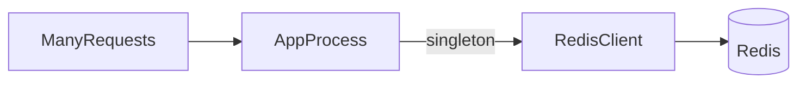

# Lesson 2: Connection Management (Long-form Enhanced)

> “One Redis client per request” is a classic production failure mode. This lesson focuses on singleton clients, graceful shutdown, and designing explicit behavior for Redis slowness/outages.

## Table of Contents

- Singleton connection pattern
- Graceful shutdown (`quit`)
- Health checks (`PING`)
- Fail-open vs fail-closed decisions
- Best practices, pitfalls, troubleshooting
- Advanced patterns (preview): connection pooling, timeouts, retry budgets

## Learning Objectives

By the end of this lesson, you will be able to:
- Use the singleton pattern for Redis connections in Node
- Understand why “one client per request” is a production anti-pattern
- Implement graceful shutdown so deployments don’t leak connections
- Add a Redis health check (`PING`) and interpret results
- Plan resilience decisions (what happens when Redis is down)

## Why Connection Management Matters

Redis is a shared infrastructure dependency. Poor connection patterns cause:
- too many open connections
- slowdowns and timeouts
- cascading failures across the system

Good patterns keep Redis usage stable even under load.



## Singleton Pattern (Recommended)

```typescript
// redis-client.ts
import { createClient } from "redis";

let client: ReturnType<typeof createClient> | null = null;

export async function getRedisClient() {
  if (!client) {
    client = createClient({
      url: process.env.REDIS_URL || "redis://localhost:6379",
    });
    await client.connect();
  }
  return client;
}
```

### Why this pattern works

- one TCP connection per process (instead of per request)
- predictable resource usage
- faster request handling

## Graceful Shutdown

When your app receives shutdown signals (deploy/scale down), close the Redis connection cleanly:

```typescript
process.on("SIGTERM", async () => {
  if (client) await client.quit();
  process.exit(0);
});
```

### Why `quit()` matters

It lets Redis close the connection cleanly and helps avoid:
- leaked connections
- long reconnect storms on deploy

## Health Check (`PING`)

Health checks help you:
- detect outages
- decide whether to use cache or fall back

```typescript
async function checkRedisHealth() {
  try {
    await client?.ping();
    return true;
  } catch {
    return false;
  }
}
```

### How to use health checks

Common patterns:
- expose `/health` endpoint that checks Redis and DB
- mark Redis as “degraded” without failing the whole service (depends on requirements)

## Resilience Decision: What If Redis Is Down?

You must decide per feature:
- **cache**: usually “fail open” (fallback to DB)
- **rate limiting**: often “fail closed” (block requests) or “fail open” (allow requests) depending on risk
- **sessions**: depends on auth model; outages can log users out or block logins

There is no universal answer—choose intentionally and document it.

## Real-World Scenario: Deploying With Rolling Restarts

During rolling deploys:
- instances stop and start
- connections are created and closed repeatedly

Graceful shutdown + singleton clients prevent:
- “too many connections”
- unnecessary reconnect storms

## Best Practices

### 1) Treat Redis like a shared limited resource

Keep connections bounded and reuse them.

### 2) Add timeouts and retries intentionally

Retries can help, but too many retries can cause thundering herds.

### 3) Observe connection behavior

Monitor:
- reconnect frequency
- command latency
- error rate

## Common Pitfalls and Solutions

### Pitfall 1: Creating a Redis client per request

**Problem:** connection explosion, slow app, Redis overload.

**Solution:** singleton client per process.

### Pitfall 2: No shutdown handling

**Problem:** hanging processes and leaked resources.

**Solution:** handle signals and call `quit()`.

### Pitfall 3: Treating Redis failures as “impossible”

**Problem:** cache dependency causes outages.

**Solution:** design fallbacks and decide fail-open vs fail-closed per feature.

## Troubleshooting

### Issue: App becomes slow when Redis is slow

**Symptoms:**
- increased latency across endpoints that use cache

**Solutions:**
1. Add timeouts and degrade gracefully.
2. Cache less or reduce dependency on Redis for critical paths.
3. Monitor Redis latency and scale/optimize Redis.

## Advanced Patterns (Preview)

### 1) Retry budgets (concept)

Retries can help, but too many retries can amplify outages. Define limits (“budget”) so failures don’t cascade.

### 2) Timeouts as protection

Treat Redis like a network dependency: set timeouts so you can fail open quickly when it’s slow.

### 3) Connection pooling (concept)

Some clients/patterns support pools. Even without explicit pools, the key rule is still: avoid per-request connects.

## Next Steps

Now that you can manage Redis connections safely:

1. ✅ **Practice**: Implement singleton client + graceful shutdown
2. ✅ **Experiment**: Simulate Redis downtime and verify fallback behavior
3. 📖 **Next Lesson**: Learn about [Basic Operations](./lesson-03-basic-operations.md)
4. 💻 **Complete Exercises**: Work through [Exercises 03](./exercises-03.md)

## Additional Resources

- [Redis: Client-side caching and resilience patterns](https://redis.io/docs/latest/develop/use/patterns/)

---

**Key Takeaways:**
- Use a singleton Redis client per process; avoid per-request clients.
- Close connections gracefully on shutdown.
- Add health checks and explicitly design behavior for Redis outages.
