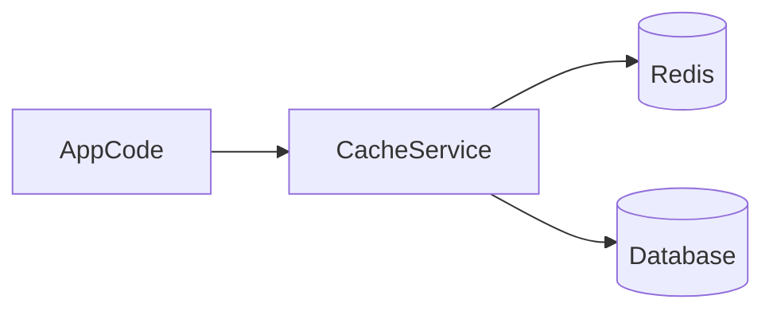

# Lesson 3: Basic Operations (Long-form Enhanced)

> A cache wrapper prevents “every call site does Redis differently”. This lesson focuses on centralizing serialization, TTL defaults, error handling, and cache key conventions.

## Table of Contents

- Why a cache wrapper helps
- Safe get/set/delete patterns
- Serialization and TTL defaults
- Key naming (namespaces + versioning)
- Best practices, pitfalls, troubleshooting
- Advanced patterns (preview): negative caching, stampede control, cache metrics

## Learning Objectives

By the end of this lesson, you will be able to:
- Build a small cache wrapper around Redis for consistent serialization and TTL handling
- Implement safe `get/set/delete` operations with predictable behavior
- Handle Redis errors gracefully and fall back to the source of truth
- Design cache key conventions (namespacing + versioning)
- Avoid common pitfalls (JSON parse failures, caching nulls incorrectly, inconsistent TTL usage)

## Why a Cache Wrapper Matters

If every call site writes Redis logic differently, you will end up with:
- inconsistent key naming
- inconsistent TTL behavior
- JSON serialization bugs
- hard-to-debug production issues

A small wrapper centralizes:
- serialization
- TTL defaults
- error handling and fallbacks



## Wrapper Functions (Cache Service)

```typescript
import { createClient } from "redis";

class CacheService {
  constructor(private client: ReturnType<typeof createClient>) {}

  async get<T>(key: string): Promise<T | null> {
    const value = await this.client.get(key);
    return value ? (JSON.parse(value) as T) : null;
  }

  async set(key: string, value: unknown, ttlSeconds?: number): Promise<void> {
    const serialized = JSON.stringify(value);
    if (ttlSeconds) {
      await this.client.setEx(key, ttlSeconds, serialized);
    } else {
      await this.client.set(key, serialized);
    }
  }

  async delete(key: string): Promise<void> {
    await this.client.del(key);
  }
}
```

### Key naming convention (recommended)

Use namespaced and versioned keys:
- `user:123:profile:v1`
- `products:popular:v2`

Versioning makes invalidation easier when payload shape changes.

## Error Handling and Fallbacks

Redis is a dependency that can fail. For caching, the safest behavior is usually:
- log the failure
- return null (cache miss)
- fetch from DB (source of truth)

```typescript
async function safeGet(key: string) {
  try {
    return await client.get(key);
  } catch (error) {
    console.error("Cache error:", error);
    // Fallback to database
    return null;
  }
}
```

### Handling JSON parse failures

If you store JSON strings, parsing can fail if:
- the value was written by older code
- the value is corrupted
- two code paths stored different shapes

A robust wrapper often treats parse errors as a cache miss (delete key, refetch).

## Real-World Scenario: Cache-Aside Helper

A common helper pattern:
1. try cache
2. if miss, fetch from DB
3. store in cache with TTL
4. return result

Centralizing this logic reduces duplicated bugs across endpoints.

## Best Practices

### 1) Decide TTL defaults per data type

- hot, volatile data: shorter TTL
- stable reference data: longer TTL

### 2) Treat cache failures as non-fatal (for caches)

Your app should keep working if Redis is down (with slower performance).

### 3) Don’t cache everything

Cache what’s hot and expensive, and measure hit rate.

## Common Pitfalls and Solutions

### Pitfall 1: JSON parse crashes

**Problem:** your app throws on `JSON.parse` and requests fail.

**Solution:** treat parse failure as cache miss; optionally delete the key and refill.

### Pitfall 2: Inconsistent TTL usage

**Problem:** some call sites set TTL; others don’t and keys live forever.

**Solution:** define wrapper defaults and enforce TTL for cache keys.

### Pitfall 3: Caching “null” incorrectly

**Problem:** you cache “not found” forever and hide future records.

**Solution:** if you cache nulls, use short TTLs and make the behavior explicit.

## Troubleshooting

### Issue: Cache hit rate is low

**Symptoms:**
- performance doesn’t improve

**Solutions:**
1. Verify keys are stable and namespaced.
2. Ensure TTL is long enough for your traffic patterns.
3. Ensure you’re caching after misses (write-back).

### Issue: Redis errors spike during traffic peaks

**Symptoms:**
- timeouts, slow commands

**Solutions:**
1. Reduce Redis dependency on hot endpoints (cache less, add fallbacks).
2. Add timeouts/backoff and monitor latency.
3. Optimize key patterns and avoid large “read all” operations.

## Advanced Patterns (Preview)

### 1) Negative caching (concept)

Caching “not found” results can reduce DB load, but it must be explicit and short-lived (or you can hide newly-created records).

### 2) Stampede control

For hot keys, consider:
- TTL jitter
- per-key locks
- stale-while-revalidate patterns

### 3) Cache metrics as first-class signals

Track:
- hit rate
- average TTL / key churn
- Redis latency
so you can tune caching with evidence, not guesses.

## Next Steps

Now that you have basic operations standardized:

1. ✅ **Practice**: Implement a cache-aside helper for one endpoint
2. ✅ **Experiment**: Add key versioning and update strategy for schema changes
3. 📖 **Next Level**: Move into caching strategies (cache-aside, write-through, write-behind)
4. 💻 **Complete Exercises**: Work through [Exercises 03](./exercises-03.md)

## Additional Resources

- [Redis: Caching patterns](https://redis.io/docs/latest/develop/use/patterns/)

---

**Key Takeaways:**
- A cache wrapper centralizes TTL, serialization, and error handling.
- Cache failures should usually degrade gracefully (miss → DB fallback).
- Use namespaced, versioned keys to reduce collisions and simplify invalidation.
