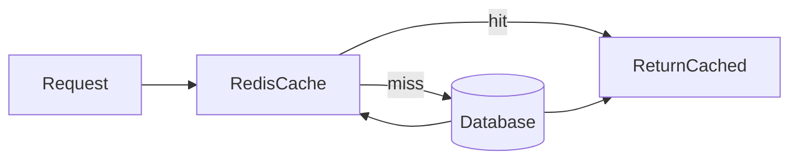

# Lesson 1: Cache-Aside Pattern (Long-form Enhanced)

> Cache-aside is the default “safe” caching pattern: DB remains the source of truth, and the system can fail open when cache is unavailable. This lesson focuses on implementing it safely (null handling, stampedes, TTL choices).

## Table of Contents

- Cache-aside flow (hit/miss)
- Key naming + TTL strategy
- Handling not-found (“negative caching”)
- Stampede risks and mitigations
- Best practices, pitfalls, troubleshooting
- Advanced patterns (preview): single-flight, SWR, dependency budgeting

## Learning Objectives

By the end of this lesson, you will be able to:
- Explain the cache-aside (lazy loading) pattern and when to use it
- Implement cache-aside safely for read-heavy endpoints
- Choose key naming and TTL strategies
- Handle cache misses, cache failures, and “not found” results correctly
- Avoid common pitfalls (stampedes, stale data, caching nulls forever)

## Why Cache-Aside Matters

Cache-aside is one of the most common caching patterns because it:
- keeps the database as the source of truth
- degrades gracefully when cache is down
- is easy to introduce incrementally on hot reads



## How It Works

1. Check cache
2. If miss, fetch from source of truth (DB)
3. Store result in cache (with TTL)
4. Return data

This is also called “lazy caching” because you only cache what gets requested.

## Implementation (Example)

```typescript
async function getUser(id: string) {
  // 1) Check cache
  const cached = await cache.get(`user:${id}`);
  if (cached) return cached;

  // 2) Fetch from database (source of truth)
  const user = await prisma.user.findUnique({ where: { id } });
  if (!user) return null;

  // 3) Store in cache
  await cache.set(`user:${id}`, user, 3600);

  return user;
}
```

### Key decisions

- **Key naming**: namespace + versioning help avoid collisions and simplify invalidation (e.g., `user:${id}:v1`)
- **TTL**: choose based on acceptable staleness and traffic patterns

## Handling “Not Found” (Cache Nulls Carefully)

If `user` doesn’t exist, you can either:
- not cache the miss (simpler, but repeated misses hit DB)
- cache a “null marker” for a short TTL (prevents DB hammering on missing IDs)

If you cache nulls, keep TTL short to avoid hiding newly created records.

## Cache Stampede (Popular Key Expiration)

If a popular key expires, many requests can miss at once and stampede the DB.

Mitigations (conceptual):
- TTL jitter (randomize expiry slightly)
- per-key locks (single flight)
- serve stale while revalidating (advanced)

## Real-World Scenario: User Profile Endpoint

`GET /users/:id` is usually:
- read-heavy
- safe to cache for short periods

Cache-aside reduces DB load and improves p95 latency while keeping DB authoritative.

## Best Practices

### 1) Treat cache as an optimization layer

If cache is unavailable, fall back to DB rather than failing the request (for typical caching).

### 2) Use TTLs by default

TTL bounds memory usage and limits worst-case staleness.

### 3) Keep cached payloads safe

Do not cache sensitive fields if cached values might be reused or exposed.

## Pros and Cons

**Pros:**
- simple to implement
- cache failures usually don’t break the app
- flexible: cache only hot reads

**Cons:**
- two round trips on cache miss (cache + DB)
- staleness unless invalidation/TTL is correct
- stampede risk on popular keys

## Common Pitfalls and Solutions

### Pitfall 1: Stale data after updates

**Problem:** DB updates happen but cached value remains.

**Solution:** invalidate or update cache on writes, or use shorter TTL until invalidation is correct.

### Pitfall 2: Cache stampede

**Problem:** DB overload when popular keys expire.

**Solution:** jitter TTLs, add per-key locking, or stale-while-revalidate.

### Pitfall 3: Caching nulls too long

**Problem:** newly created users don’t show up.

**Solution:** if caching nulls, use short TTL and a clear marker.

## Troubleshooting

### Issue: Cache hit rate is low

**Symptoms:**
- DB load unchanged

**Solutions:**
1. Ensure key is stable (`user:${id}`) and not including changing params.
2. Increase TTL for stable data.
3. Verify `cache.set` is being called on misses.

## Advanced Patterns (Preview)

### 1) Single-flight / per-key locks (concept)

Prevent 100 concurrent misses from triggering 100 DB queries by letting one request populate the cache while others wait (or serve stale).

### 2) Stale-while-revalidate

Serve slightly stale data while refreshing in the background to reduce tail latency and stampedes for hot keys.

### 3) Dependency budgeting

Treat Redis as a dependency with a budget: timeouts, fast fallbacks, and explicit “what happens if Redis is slow/down”.

## Next Steps

Now that you understand cache-aside:

1. ✅ **Practice**: Add cache-aside to a read-heavy endpoint and measure p95 latency
2. ✅ **Experiment**: Add TTL jitter to reduce stampede risk
3. 📖 **Next Lesson**: Learn about [Write-Through](./lesson-02-write-through.md)
4. 💻 **Complete Exercises**: Work through [Exercises 04](./exercises-04.md)

## Additional Resources

- [Redis: Cache-aside pattern](https://redis.io/docs/latest/develop/use/patterns/#cache-aside)

---

**Key Takeaways:**
- Cache-aside checks cache first, then falls back to DB and fills cache on misses.
- Use TTLs and stable key naming; consider versioning for payload changes.
- Plan for staleness and stampedes with invalidation and mitigation strategies.
