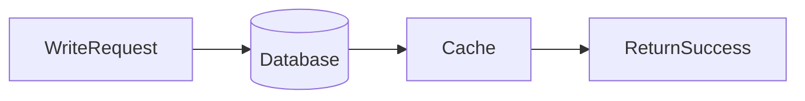

# Lesson 2: Write-Through Pattern (Long-form Enhanced)

> Write-through reduces stale reads by updating cache as part of the write path. This lesson focuses on when it’s worth it, what to do when cache writes fail, and how to avoid unnecessary write load.

## Table of Contents

- Write-through flow (write → cache update)
- Failure modes (DB success, cache failure)
- Choosing keys/TTL/representation
- When write-through beats cache-aside
- Best practices, pitfalls, troubleshooting
- Advanced patterns (preview): write coalescing, dual writes, event-driven invalidation

## Learning Objectives

By the end of this lesson, you will be able to:
- Explain the write-through caching pattern (write cache + store of truth together)
- Implement write-through behavior for create/update operations
- Understand consistency trade-offs and failure modes
- Choose when write-through is appropriate vs cache-aside
- Avoid common pitfalls (partial failures, caching private fields, unnecessary writes)

## Why Write-Through Matters

Cache-aside improves reads, but cached data can become stale after writes unless you invalidate/update.
Write-through reduces staleness by ensuring writes update the cache as part of the write flow.



## How It Works

Conceptually:
1. Write to the database (source of truth)
2. Update cache with the new value (same request)
3. Return success

Some descriptions say “write to cache then DB”; in practice, for many apps it’s safer to:
- write to DB first (ensures truth exists)
- then update cache

## Implementation (Example)

```typescript
async function createUser(data: CreateUserData) {
  // 1) Create in database (source of truth)
  const user = await prisma.user.create({ data });

  // 2) Write to cache (write-through)
  await cache.set(`user:${user.id}`, user, 3600);

  return user;
}
```

### Update operations

Write-through applies to updates too:
- update DB
- update cache with new representation

## Failure Modes (What If Cache Write Fails?)

A key design decision:
- if DB write succeeds but cache write fails, do you fail the request?

Common approach for caching:
- **do not fail the request**
- log the cache failure
- allow the next read to repopulate cache (cache-aside recovery)

Write-through improves freshness, but DB remains the source of truth.

## Real-World Scenario: User Profile Updates

If users update their profile and immediately reload the page:
- stale cache causes confusing UX
- write-through prevents that by updating cache on write

## Best Practices

### 1) Keep DB authoritative

Write-through updates cache, but DB must remain the source of truth.

### 2) Decide what happens on cache failure

Document fail-open vs fail-closed behavior per endpoint.

### 3) Cache only safe fields

Be careful not to cache secrets (password hashes, tokens) if cached payloads could leak.

## Pros and Cons

**Pros:**
- cache is fresher after writes
- fewer “update then stale read” bugs

**Cons:**
- slower writes (extra cache operation)
- adds failure mode (cache could be unavailable)
- can increase Redis write load on high-write systems

## Common Pitfalls and Solutions

### Pitfall 1: Partial failures (DB OK, cache fail)

**Problem:** request fails even though data is written.

**Solution:** treat cache failure as non-fatal and fall back to cache-aside on reads.

### Pitfall 2: Over-caching on every write

**Problem:** Redis write load increases, but cache isn’t providing value.

**Solution:** only write-through the keys that are actually read frequently.

### Pitfall 3: Wrong key representation/versioning

**Problem:** cache contains mismatched schema and JSON parse fails later.

**Solution:** version keys (e.g., `user:${id}:v1`) and roll forward safely.

## Troubleshooting

### Issue: Users see stale data after updates

**Symptoms:**
- update returns success, but subsequent reads show old values

**Solutions:**
1. Ensure cache is updated/invalidation occurs on the write path.
2. Reduce TTL temporarily while validating invalidation logic.
3. Verify key naming is consistent between reads and writes.

## Advanced Patterns (Preview)

### 1) Write coalescing (concept)

If many writes happen quickly, consider batching/coalescing cache updates to reduce Redis write load.

### 2) Dual writes and ordering

When you update multiple keys (e.g., `user:id` and `users:list`), define an ordering and failure strategy to avoid inconsistent partial updates.

### 3) Event-driven invalidation (concept)

Instead of updating cache inline, some systems publish events (“user updated”) and let consumers update/invalidate caches asynchronously.

## Next Steps

Now that you understand write-through:

1. ✅ **Practice**: Add write-through update for a cached read endpoint
2. ✅ **Experiment**: Measure write latency impact and Redis load
3. 📖 **Next Lesson**: Learn about [Write-Behind](./lesson-03-write-behind.md)
4. 💻 **Complete Exercises**: Work through [Exercises 04](./exercises-04.md)

## Additional Resources

- [Redis: Caching patterns](https://redis.io/docs/latest/develop/use/patterns/)

---

**Key Takeaways:**
- Write-through updates cache as part of the write flow to reduce staleness.
- DB remains the source of truth; cache failures are usually non-fatal for typical caching.
- Use write-through selectively where it prevents real stale-read UX bugs.
