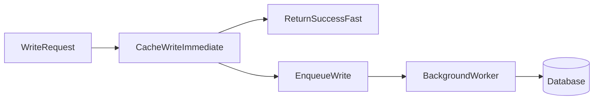

# Lesson 3: Write-Behind Pattern (Long-form Enhanced)

> Write-behind can make writes feel fast by acknowledging after cache write and persisting later—but it introduces real durability and consistency risk. This lesson focuses on when it’s appropriate and what infrastructure it requires.

## Table of Contents

- Write-behind flow (cache first, DB later)
- Eventual consistency and risk
- Safe pipeline design (queue + worker)
- Where write-behind is appropriate (and where it’s not)
- Best practices, pitfalls, troubleshooting
- Advanced patterns (preview): idempotency, DLQs, backpressure

## Learning Objectives

By the end of this lesson, you will be able to:
- Explain write-behind (write-back) caching and why it can make writes fast
- Understand durability and consistency risks (data loss, eventual consistency)
- Identify where write-behind is appropriate (analytics, counters, non-critical writes)
- Design a safe pipeline (queue + retries + dead-letter handling)
- Avoid common pitfalls (assuming durability, missing retries, cache eviction before DB write)

## Why Write-Behind Matters

Write-through improves freshness but adds work on the critical write path.
Write-behind makes writes feel fast by:
- writing to cache immediately
- persisting to DB asynchronously

This can improve UX and throughput, but it increases complexity and risk.



## How It Works

1. Write to cache immediately
2. Queue the database write
3. Background worker writes to database asynchronously

This means the system becomes **eventually consistent**.

## Implementation (Conceptual)

```typescript
async function updateUser(id: string, data: UpdateUserData) {
  // 1) Update cache immediately
  const cachedUser = await cache.get(`user:${id}`);
  const updated = { ...cachedUser, ...data };
  await cache.set(`user:${id}`, updated, 3600);

  // 2) Queue database update (async persistence)
  queueDatabaseUpdate(id, data);

  return updated;
}
```

### Important note

The key to write-behind is not the code above—it’s the reliability of the queue/worker system:
- retries
- idempotency
- monitoring
- dead-letter queues

## When to Use Write-Behind (And When Not To)

Good candidates:
- analytics events (page views, clicks)
- counters/metrics that can tolerate delays
- background updates where eventual consistency is acceptable

Use extreme caution for:
- payments and financial data
- auth and permissions
- any data where “write acknowledged” must mean durable

## Failure Modes (Reality Check)

Write-behind introduces risks:
- cache eviction before DB write → lost update
- worker crashes or queue backlog → long delays
- duplicate processing → inconsistent writes unless idempotent

## Real-World Scenario: Event Tracking

For “track user action” events:
- you want very fast writes
- occasional delays are acceptable
- losing a small fraction may be acceptable depending on product needs

Write-behind can be appropriate here, especially with batching.

## Best Practices

### 1) Make writes idempotent

Workers should be able to retry without corrupting data.

### 2) Treat queue/worker as critical infrastructure

Monitor:
- queue depth
- retry rate
- processing latency

### 3) Define durability guarantees explicitly

Document what “success” means for write-behind operations.

## Pros and Cons

**Pros:**
- very fast perceived writes
- improved UX on write-heavy actions
- can batch DB writes for efficiency

**Cons:**
- risk of data loss or delayed persistence
- eventual consistency (reads from DB may lag)
- much higher operational complexity

## Common Pitfalls and Solutions

### Pitfall 1: Assuming write durability

**Problem:** client sees success, but write never reaches DB.

**Solution:** only use write-behind where this is acceptable, or design stronger durability with queues and acknowledgements.

### Pitfall 2: No retry/backoff/dead-letter handling

**Problem:** transient DB failure causes permanent data loss.

**Solution:** implement retries with backoff and dead-letter queues.

### Pitfall 3: Cache eviction before persistence

**Problem:** updates exist only in cache and are evicted.

**Solution:** keep persistence pipeline robust and consider shorter delay windows or stronger persistence guarantees.

## Troubleshooting

### Issue: Database lags behind cache

**Symptoms:**
- DB reads show older values

**Solutions:**
1. Monitor queue depth and worker processing latency.
2. Scale workers or reduce write volume via batching.
3. Ensure idempotency so you can retry safely.

## Advanced Patterns (Preview)

### 1) Idempotency as a requirement

Your worker must be able to retry safely without corrupting state. Design writes so “processing twice” is not catastrophic.

### 2) Dead-letter queues (DLQs) (concept)

When retries keep failing, you need a place for poisoned messages plus an ops process to investigate and reprocess.

### 3) Backpressure and load shedding

If the queue backs up, decide:
- how to degrade gracefully
- whether to drop low-value writes
- how to protect the DB from retry storms

## Next Steps

Now that you understand write-behind trade-offs:

1. ✅ **Practice**: Identify which writes in your app can tolerate eventual consistency
2. ✅ **Experiment**: Design a queue + worker pipeline with retries and metrics
3. 📖 **Next Level**: Move into advanced invalidation and TTL strategies
4. 💻 **Complete Exercises**: Work through [Exercises 04](./exercises-04.md)

## Additional Resources

- [Redis: Caching patterns](https://redis.io/docs/latest/develop/use/patterns/)

---

**Key Takeaways:**
- Write-behind returns fast by persisting asynchronously, trading consistency for speed.
- It requires reliable queue/worker infrastructure and idempotent writes.
- Use it only where eventual consistency and potential loss/delay are acceptable.
