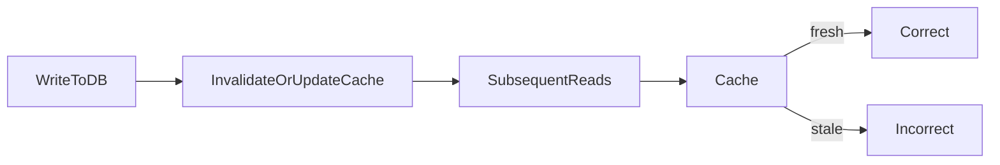

# Lesson 1: Cache Invalidation (Long-form Enhanced)

> Cache invalidation is “the hard part” because it’s where correctness meets performance. This lesson focuses on safe invalidation strategies that don’t melt Redis or leak stale data after writes.

## Table of Contents

- Why invalidation is hard
- TTL vs event-based invalidation
- Avoiding dangerous patterns (`KEYS`, global flush)
- Key versioning and cache tags
- Best practices, pitfalls, troubleshooting
- Advanced patterns (preview): fanout invalidation, write ordering, stampede control

## Learning Objectives

By the end of this lesson, you will be able to:
- Explain why cache invalidation is the hardest part of caching
- Use TTL-based and event-based invalidation strategies appropriately
- Avoid dangerous invalidation patterns (global flushes, broad key scans)
- Use key versioning to simplify invalidation when schemas change
- Recognize common pitfalls (stale reads after writes, thundering herds after invalidation)

## Why Cache Invalidation Matters

Caching is easy to add. Keeping cached data correct is hard.

Invalidation answers: “When the source of truth changes, how do we ensure cache doesn’t serve incorrect data?”



## Invalidation Strategies

### Time-Based (TTL)

```typescript
await cache.set('key', 'value', 3600); // Expires in 1 hour
```

#### When TTL is enough

TTL-based invalidation is great when:
- data can be slightly stale
- you want simplicity
- you can tolerate eventual consistency

TTL also bounds cache size.

### Event-Based

```typescript
async function updateUser(id: string, data: UpdateData) {
  await prisma.user.update({ where: { id }, data });
  await cache.del(`user:${id}`); // Invalidate cache
}
```

#### When event-based invalidation is needed

Use event-based invalidation when:
- staleness is unacceptable after a write
- users expect immediate consistency after updates

### Pattern-Based

```typescript
async function invalidateUserCache(userId: string) {
  const keys = await cache.keys(`user:${userId}:*`);
  await Promise.all(keys.map(key => cache.del(key)));
}
```

#### Warning: pattern scans are dangerous at scale

`KEYS` is typically a bad idea in production because it can:
- block Redis on large keyspaces
- create latency spikes

Prefer:
- explicit key lists
- key versioning
- tag sets (implemented safely)

## Cache Tags

```typescript
// Store with tags
await cache.set('user:1', user, { tags: ['user', 'user:1'] });

// Invalidate by tag
await cache.invalidateTag('user');
```

## Key Versioning (Simple, Powerful)

If you can’t reliably find and delete all dependent keys, versioning can be safer.

Example:
- `user:123:v1`
- bump to `v2` when payload shape changes or invalidation logic changes

This “invalidates” old keys by making them unreachable (they expire naturally).

## Real-World Scenario: Profile Update

User updates profile:
- backend writes to DB
- invalidate `user:${id}` cache key
- next read refills with fresh data

This avoids the common UX bug: “I updated my profile but still see old values.”

## Best Practices

### 1) Start with TTLs, add event invalidation where needed

Don’t over-engineer invalidation from day one—add complexity only for endpoints that need stronger freshness.

### 2) Avoid Redis `KEYS` in production

Use predictable keys and invalidate them directly.

### 3) Plan stampedes after invalidation

Invalidating popular keys can create a miss spike (DB load). Consider:
- TTL jitter
- soft invalidation / stale-while-revalidate (advanced)
- per-key locks

## Common Pitfalls and Solutions

### Pitfall 1: Stale cache after writes

**Problem:** cache is not invalidated/updated when DB changes.

**Solution:** invalidate/update on write path (write-through) or event-based invalidation.

### Pitfall 2: Broad invalidation causes DB overload

**Problem:** invalidating many keys at once causes stampede.

**Solution:** stagger invalidation, add jitter, use background refresh.

### Pitfall 3: Using `KEYS` on large keyspaces

**Problem:** Redis becomes slow or unresponsive.

**Solution:** avoid pattern scans; use explicit keys, versioning, or tag sets.

## Troubleshooting

### Issue: Users see stale data after update

**Symptoms:**
- update succeeds but UI still shows old data

**Solutions:**
1. Confirm the write path invalidates or updates the correct key.
2. Confirm the read path uses the same key naming/versioning scheme.
3. Reduce TTL temporarily while debugging invalidation correctness.

## Advanced Patterns (Preview)

### 1) Fanout invalidation (concept)

When one write affects many cached views (lists, aggregates), you need a strategy to invalidate/update many keys safely without scanning the whole keyspace.

### 2) Write ordering and atomicity

If you update DB and multiple cache keys, define an ordering and a failure strategy so you don’t end up with partial stale state.

### 3) Stampede after invalidation

Invalidation can cause a “thundering herd” of misses. Combine invalidation with jitter, locks, or SWR patterns for hot keys.

## Next Steps

Now that you understand invalidation:

1. ✅ **Practice**: Add event-based invalidation to one write endpoint
2. ✅ **Experiment**: Use key versioning to simplify invalidation for a complex payload
3. 📖 **Next Lesson**: Learn about [TTL Strategies](./lesson-02-ttl-strategies.md)
4. 💻 **Complete Exercises**: Work through [Exercises 05](./exercises-05.md)

## Additional Resources

- [Redis: Expiration](https://redis.io/docs/latest/develop/use/keyspace/#key-expiration)

---

**Key Takeaways:**
- Invalidation is hard; TTL is the simplest tool and often enough.
- Event-based invalidation gives fresher data but adds complexity.
- Avoid `KEYS` pattern scans in production; prefer explicit keys and versioning.
