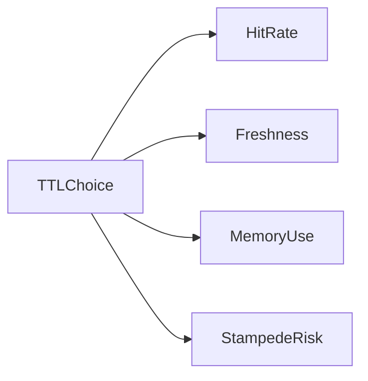

# Lesson 2: TTL Strategies (Long-form Enhanced)

> TTL is one of the most important “knobs” in caching. This lesson focuses on choosing TTLs intentionally, understanding the trade-offs, and preventing stampedes when hot keys expire.

## Table of Contents

- TTL trade-offs (freshness, hit rate, memory)
- Fixed vs sliding vs adaptive TTL
- Jitter to reduce stampedes
- When “no TTL” is acceptable (rare)
- Best practices, pitfalls, troubleshooting
- Advanced patterns (preview): SWR, refresh-ahead, TTL by endpoint criticality

## Learning Objectives

By the end of this lesson, you will be able to:
- Choose an appropriate TTL strategy (fixed, sliding, adaptive) for different data types
- Understand how TTL affects hit rate, staleness, and memory usage
- Use TTL jitter to reduce cache stampedes
- Decide when “no TTL” is acceptable (rare) and how to invalidate safely
- Avoid common pitfalls (TTL too short, TTL too long, sliding TTL hiding updates)

## Why TTL Strategy Matters

TTL is one of the most important knobs in caching because it directly controls:
- freshness (staleness window)
- memory growth (how long keys stick around)
- hit rate (how often cache is used)
- failure behavior under load (stampedes)



## Fixed TTL

Fixed TTL means every write uses the same expiry:

```typescript
await cache.set("key", "value", 3600); // Always 1 hour
```

### When fixed TTL is good

- stable data (reference lists)
- simple caching needs
- you don’t want complexity

## Sliding TTL

Sliding TTL extends expiry on access (“keep hot keys hot”):

```typescript
async function getWithSlidingTTL(key: string) {
  const value = await cache.get(key);
  if (value) {
    // Extend TTL on access
    await cache.expire(key, 3600);
  }
  return value;
}
```

### When sliding TTL helps

- session-like data
- hot keys that should remain cached while in use

### Sliding TTL caveat

Sliding TTL can increase staleness risk if you rely on TTL expiry to refresh data.
Event invalidation becomes more important.

## Adaptive TTL

Adaptive TTL varies based on usage:

```typescript
function calculateTTL(accessFrequency: number): number {
  // More frequent = longer TTL
  if (accessFrequency > 100) return 7200; // 2 hours
  if (accessFrequency > 50) return 3600; // 1 hour
  return 1800; // 30 minutes
}
```

### When adaptive TTL helps

- mixed workloads where some keys are very hot
- you want to reduce churn on hot keys without over-caching cold keys

This adds complexity and is usually a later optimization.

## TTL Jitter (Stampede Mitigation)

If many keys expire at the same time, a stampede can hammer the DB.
A simple mitigation is to randomize TTL slightly:
- base TTL ± random jitter

This spreads expirations over time.

## No TTL (Use With Extreme Caution)

```typescript
await cache.set("key", "value"); // No expiration
// Manually invalidate when needed
```

No TTL can be acceptable when:
- key set is small and bounded
- invalidation is reliable and explicit

But it’s risky because:
- memory growth can be unbounded
- stale data can persist indefinitely

## Real-World Scenario: Caching Product Data

Common approach:
- fixed TTL (60–300 seconds) for product reads
- event invalidation on product updates
- jitter TTL for high-traffic products

This balances freshness and performance.

## Best Practices

### 1) Start simple (fixed TTL) and measure

Most systems do well with fixed TTL + targeted invalidation.

### 2) Use TTLs for cache safety

TTL is your “safety net” against unbounded growth and permanent staleness.

### 3) Use jitter for high-traffic keys

Jitter is cheap and reduces stampedes significantly.

## Common Pitfalls and Solutions

### Pitfall 1: TTL too short

**Problem:** low hit rate, no performance gains.

**Solution:** increase TTL and measure hit rate.

### Pitfall 2: TTL too long

**Problem:** users see stale data for too long.

**Solution:** reduce TTL or add event-based invalidation on writes.

### Pitfall 3: Sliding TTL hides updates

**Problem:** hot keys never expire and keep serving stale data.

**Solution:** combine sliding TTL with explicit invalidation when the source changes.

## Troubleshooting

### Issue: Cache stampede after expiration

**Symptoms:**
- DB CPU spikes when a key expires

**Solutions:**
1. Add TTL jitter.
2. Add per-key locking/single-flight.
3. Use stale-while-revalidate patterns (advanced).

## Advanced Patterns (Preview)

### 1) Refresh-ahead (concept)

Refresh hot keys before they expire (often in a background job) to avoid stampedes during peak traffic.

### 2) TTL by endpoint criticality

Not all data is equal:
- public, read-heavy endpoints often tolerate staleness
- user-facing “just updated” views often need shorter TTL or write-through

### 3) SWR as a latency tool

Stale-while-revalidate can improve p95 latency by avoiding synchronous refresh work on the request path.

## Next Steps

Now that you can choose TTL strategies:

1. ✅ **Practice**: Pick TTLs for 3 endpoints and justify them
2. ✅ **Experiment**: Add jitter to a hot cache key and observe DB load changes
3. 📖 **Next Lesson**: Learn about [Cache Warming](./lesson-03-cache-warming.md)
4. 💻 **Complete Exercises**: Work through [Exercises 05](./exercises-05.md)

## Additional Resources

- [Redis: Key expiration](https://redis.io/docs/latest/develop/use/keyspace/#key-expiration)

---

**Key Takeaways:**
- TTL controls freshness, memory usage, and hit rate.
- Fixed TTL is a great default; sliding/adaptive TTL add complexity.
- Add TTL jitter to reduce stampedes on popular keys.
