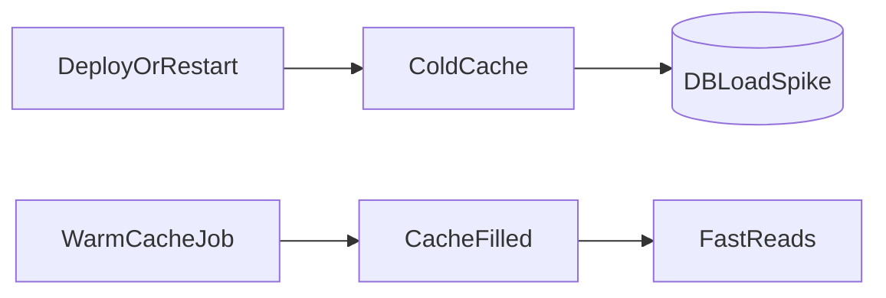

# Lesson 3: Cache Warming (Long-form Enhanced)

> Cold caches cause latency spikes and DB overload after deploys/restarts. This lesson focuses on warming only what’s worth warming, doing it safely (batching/concurrency limits), and avoiding self-inflicted outages.

## Table of Contents

- What cache warming is (and when it helps)
- What to warm (hot keys only)
- Safe warming strategies (batching, rate limits, backoff)
- When to run warming (startup vs scheduled vs post-deploy)
- Best practices, pitfalls, troubleshooting
- Advanced patterns (preview): locks/coordination, refresh-ahead, warm validation

## Learning Objectives

By the end of this lesson, you will be able to:
- Explain what cache warming is and why it reduces cold-start latency
- Identify what data is worth warming (hot keys) vs not worth warming
- Implement safe warming strategies (batching, rate limiting, backoff)
- Understand when warming should run (startup, scheduled, post-deploy)
- Avoid common pitfalls (warming too much, DB overload, stale warmed data)

## Why Cache Warming Matters

Without warming, caches start “cold” after:
- deploys/restarts
- cache evictions
- Redis failovers

Cold caches cause:
- cache miss spikes
- DB load spikes
- slower p95 latency

Warming pre-populates the hottest keys so your system stays responsive.



## What is Cache Warming?

Cache warming is pre-populating cache with frequently accessed data before requests arrive.

## When to Warm Cache

Common triggers:
- application startup (carefully)
- scheduled jobs (hourly/daily)
- after a cache flush (rare, but sometimes)
- before known high traffic windows

## Implementation (Basic Example)

```typescript
async function warmCache() {
  // Fetch popular data
  const popularUsers = await prisma.user.findMany({
    where: { active: true },
    take: 100,
  });

  // Store in cache
  for (const user of popularUsers) {
    await cache.set(`user:${user.id}`, user, 3600);
  }
}

// Warm on startup (use with caution)
warmCache();
```

### Make warming safe

For production systems, add:
- batching
- concurrency limits
- backoff on DB/Redis errors

Otherwise warming can overload your database.

## Scheduled Warming

```typescript
// Warm cache every hour
setInterval(warmCache, 60 * 60 * 1000);
```

### Scheduling considerations

- schedule during lower traffic if it hits the DB heavily
- ensure jobs don’t overlap (avoid concurrent warmers)

## What to Warm (Choose Hot Keys)

Warm only the small set of keys that:
- are requested frequently
- are expensive to compute/fetch
- cause noticeable latency when cold

Examples:
- “top products”
- “featured categories”
- global config/feature flags

Avoid warming:
- per-user personalized data at scale
- large keyspaces (millions of keys)

## Real-World Scenario: Post-Deploy Miss Spike

After deploy:
- cache is cold
- homepage endpoints miss
- DB CPU spikes

Warming can smooth deployments by preloading “top N” keys and reducing the initial spike.

## Best Practices

### 1) Keep warming bounded

Warm a limited number of keys and measure impact.

### 2) Warm from real traffic insights

Use logs/metrics to identify hot keys rather than guessing.

### 3) Combine warming with TTL strategy

Warmed keys should still have TTLs so they refresh over time.

## Common Pitfalls and Solutions

### Pitfall 1: Warming too much

**Problem:** warming overloads the DB and makes things worse.

**Solution:** limit concurrency, batch work, and warm only hot keys.

### Pitfall 2: Warming stale data

**Problem:** warmed values remain stale and users see outdated results.

**Solution:** use TTLs and invalidate on writes; don’t rely solely on warming for freshness.

### Pitfall 3: Warming on every instance startup

**Problem:** during scaling events, many instances warm at once (stampede).

**Solution:** run warming as a single job (cron/worker), not per instance, or coordinate with locks.

## Troubleshooting

### Issue: Cache warming increases DB load significantly

**Symptoms:**
- CPU spikes during warm job

**Solutions:**
1. Reduce the number of keys warmed.
2. Add delays/batching.
3. Schedule during off-peak windows.

## Advanced Patterns (Preview)

### 1) Distributed locks (concept)

Ensure only one warming job runs at a time (especially during scaling events), or you can accidentally stampede your DB.

### 2) Refresh-ahead + warming

Warming can be paired with refresh-ahead so hot keys stay warm without relying on synchronous misses.

### 3) Validate warmed data

If you warm incorrectly (wrong keys/version), you can serve broken data faster. Add simple validation checks and observability.

## Next Steps

Now that you understand cache warming:

1. ✅ **Practice**: Identify 10 hot keys and build a safe warming job
2. ✅ **Experiment**: Add concurrency limits and compare DB load during warm
3. 📖 **Next Level**: Move into production caching (monitoring and performance)
4. 💻 **Complete Exercises**: Work through [Exercises 05](./exercises-05.md)

## Additional Resources

- [Redis: Caching patterns](https://redis.io/docs/latest/develop/use/patterns/)

---

**Key Takeaways:**
- Cache warming reduces cold-start latency and DB miss spikes after deploys.
- Warm only the hottest keys and keep warming bounded and rate-limited.
- Combine warming with TTL and invalidation for long-term correctness.
