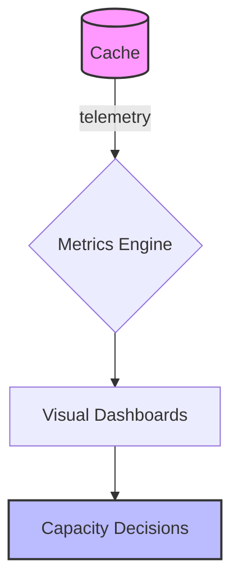

# Lesson 1: Cache Monitoring (Long-form Enhanced)

> Caching changes system behavior. Monitoring is what turns caching from “maybe faster” into an engineering tool you can trust: hit rate, latency, memory pressure, evictions, and errors.

## Table of Contents

- High-signal cache metrics (hit rate, latency, evictions)
- What “good” looks like (and what’s suspicious)
- Application-layer instrumentation (hits/misses)
- Redis `INFO` basics
- Best practices, pitfalls, troubleshooting
- Advanced patterns (preview): SLOs, alerting, capacity planning

## Learning Objectives

By the end of this lesson, you will be able to:

- Identify the most important cache metrics (hit rate, latency, memory, evictions)
- Understand what “good” looks like and how to interpret changes over time
- Instrument cache operations (hits/misses) at the application layer
- Use Redis `INFO` as a basic diagnostic tool
- Avoid common pitfalls (optimizing hit rate at the expense of correctness, missing eviction signals)

## Why Cache Monitoring Matters

Caching changes system behavior. Without monitoring, you won’t know if your cache is:

- helping performance
- hiding bugs with stale data
- causing outages via stampedes or evictions

Monitoring turns caching from guesswork into an engineering tool.



## Key Metrics (High Signal)

- **Hit rate**: % of requests served from cache (higher is usually better)
- **Miss rate**: % of requests going to the source (DB)
- **Latency**: cache operation time (p50/p95)
- **Memory usage**: Redis memory consumption
- **Evictions**: keys evicted due to memory pressure (danger signal)
- **Errors/timeouts**: Redis unavailable or slow

### Interpreting hit rate

High hit rate is not always “good”:

- if invalidation is broken, you may be serving stale data efficiently

Correctness first, then performance.

## Application-Level Instrumentation (Hits/Misses)

```typescript
class CacheMetrics {
  private hits = 0;
  private misses = 0;

  recordHit() {
    this.hits++;
  }

  recordMiss() {
    this.misses++;
  }

  getHitRate(): number {
    const total = this.hits + this.misses;
    return total > 0 ? (this.hits / total) * 100 : 0;
  }
}
```

### Production note

In production you typically emit metrics to a system (Prometheus/CloudWatch/Datadog) rather than keeping counters only in memory.

## Redis `INFO` (Basic Diagnostics)

```typescript
const info = await client.info("stats");
console.log(info);
```

This can help you inspect:

- command stats
- keyspace stats
- eviction behavior (depending on section)

## Real-World Scenario: Eviction Storm

If Redis starts evicting many keys:

- hit rate may drop
- DB load spikes
- latency increases

Monitoring evictions early lets you:

- increase memory
- reduce cached key volume
- shorten TTLs for low-value keys

## Best Practices

### 1) Monitor DB load alongside cache metrics

Caching is a means; the goal is reducing DB load and improving latency.

### 2) Watch for evictions and timeouts

These are often early indicators of impending incidents.

### 3) Instrument by endpoint/key family

Overall hit rate can hide that one critical endpoint has poor cache performance.

## Common Pitfalls and Solutions

### Pitfall 1: Only tracking hit rate

**Problem:** you miss increased latency, timeouts, or evictions.

**Solution:** track hit rate + latency + memory + evictions + errors.

### Pitfall 2: Optimizing hit rate by increasing TTL too much

**Problem:** users see stale data and correctness issues.

**Solution:** combine TTL with invalidation and monitor stale-read bugs.

### Pitfall 3: No alerting for cache degradation

**Problem:** you learn cache is broken only when DB is down.

**Solution:** alert on cache errors/timeouts and DB saturation.

## Troubleshooting

### Issue: Hit rate is high but users complain about stale data

**Symptoms:**

- “I updated but still see old values”

**Solutions:**

1. Add event-based invalidation on write paths.
2. Reduce TTL while fixing invalidation.
3. Add tests for stale-read regressions.

## Advanced Patterns (Preview)

### 1) SLOs for cache behavior (concept)

Define what “healthy caching” means (e.g., hit rate range, max latency, eviction threshold) so alerts reflect user-impact risk, not vanity metrics.

### 2) Alerting on evictions

Evictions often mean you’re out of memory (or TTLs are wrong). Treat eviction spikes as a high-signal warning.

### 3) Capacity planning

Use key count + average payload size + TTL churn to estimate memory needs, then add headroom for peak traffic and deploy events.

## Next Steps

Now that you can monitor caches:

1. ✅ **Practice**: Add per-endpoint hit/miss metrics
2. ✅ **Experiment**: Alert on eviction spikes and Redis timeouts
3. 📖 **Next Lesson**: Learn about [Performance Optimization](./lesson-02-performance-optimization.md)
4. 💻 **Complete Exercises**: Work through [Exercises 06](./exercises-06.md)

## Additional Resources

- [Redis INFO command](https://redis.io/commands/info/)

---

**Key Takeaways:**

- Monitor hit rate, latency, memory usage, evictions, and errors to operate caches safely.
- High hit rate is useless if invalidation is wrong—correctness comes first.
- Evictions and timeouts are early warning signals of cache-related incidents.
