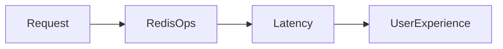

# Lesson 2: Performance Optimization (Long-form Enhanced)

> Redis is fast, but caching can still be slow if you make too many round trips, store huge payloads, or serialize inefficiently. This lesson focuses on the highest-impact performance levers without sacrificing correctness.

## Table of Contents

- Reducing round trips (pipelining)
- Connection usage (singleton + keepalive)
- Payload size and compression trade-offs
- Key naming for operability and correctness
- Best practices, pitfalls, troubleshooting
- Advanced patterns (preview): batching, hot-key mitigation, cache admission

## Learning Objectives

By the end of this lesson, you will be able to:
- Reduce cache overhead by optimizing connection usage and command patterns
- Use pipelining/transactions where appropriate to reduce round trips
- Understand when compression helps (and when it hurts)
- Design key naming conventions that improve operability and correctness
- Avoid common pitfalls (over-compressing small values, giant keys, chatty Redis usage)

## Why Performance Optimization Matters

Redis is fast, but your overall cache performance can still suffer due to:
- too many network round trips
- inefficient serialization
- large payloads
- bad access patterns

Optimization is about reducing latency and load without sacrificing correctness.



## Connection Settings (Keep Alive)

Keep connections healthy and avoid reconnect churn:

```typescript
const client = createClient({
  url: process.env.REDIS_URL,
  socket: {
    keepAlive: true,
  },
});
```

### Reminder

Use a singleton client per process; connection “pooling” in Redis clients usually means “don’t reconnect all the time”, not “many connections per request”.

## Pipeline Operations (Reduce Round Trips)

If you need to execute multiple commands, pipelining can reduce network overhead:

```typescript
const pipeline = client.multi();
pipeline.set("key1", "value1");
pipeline.set("key2", "value2");
pipeline.set("key3", "value3");
await pipeline.exec();
```

### When pipelining helps

- populating multiple keys (warming)
- writing multiple related cache entries

### When it doesn’t

If you only need 1 command, pipelining adds complexity without gain.

## Compression (Trade-offs)

Compression can reduce memory usage and network transfer for large values.

```typescript
import { gzip, gunzip } from "zlib";
import { promisify } from "util";

const gzipAsync = promisify(gzip);
const gunzipAsync = promisify(gunzip);

// Compress before storing
const compressed = await gzipAsync(JSON.stringify(data));
await client.set("key", compressed.toString("base64"));
```

### When compression helps

- large JSON payloads (tens of KB+)
- bandwidth-constrained environments

### When compression hurts

- small payloads (CPU overhead dominates)
- high-throughput endpoints (CPU becomes bottleneck)

Measure before adopting.

## Key Naming (Operability + Correctness)

Consistent naming improves:
- debugging
- invalidation strategies
- avoiding collisions and WRONGTYPE

```typescript
// Good
`user:${id}`
`post:${id}:comments`
`session:${sessionId}`

// Bad
`user${id}`
`post_${id}_comments`
```

### Add versioning for schema changes

Example: `user:${id}:profile:v2`

## Real-World Scenario: Slow Cache Doesn’t Help

If you do many sequential Redis calls per request, caching can become a new bottleneck.
Optimizations:
- reduce number of Redis calls (batch/pipeline)
- store data in fewer keys when appropriate
- keep payloads smaller (select fewer fields)

## Best Practices

### 1) Reduce chattiness

Prefer fewer Redis calls per request; batch where possible.

### 2) Keep payloads small

Cache minimal data needed by the client; avoid caching huge objects by default.

### 3) Measure impact

Track:
- Redis latency
- cache hit rate
- overall endpoint latency
- DB load reduction

## Common Pitfalls and Solutions

### Pitfall 1: Compressing everything

**Problem:** CPU spikes and higher latency.

**Solution:** compress only large values and measure.

### Pitfall 2: Giant keys and unbounded values

**Problem:** memory pressure and slow commands.

**Solution:** bound value size and collection growth; use TTLs.

### Pitfall 3: Too many Redis round trips

**Problem:** caching adds latency.

**Solution:** pipeline/batch and redesign key layout for fewer operations.

## Troubleshooting

### Issue: Redis is fast but endpoint latency is still high

**Symptoms:**
- cache latency low, but response time high

**Solutions:**
1. Identify other bottlenecks (DB, external APIs, serialization).
2. Reduce payload size and per-request work.
3. Validate caching is applied to the right endpoints.

## Advanced Patterns (Preview)

### 1) Batching and admission control (concept)

Not every value is worth caching. Some systems use admission policies to avoid polluting cache with low-reuse items.

### 2) Hot-key mitigation

Extremely hot keys can create contention. Techniques include sharding keys, adding local L1 caches, or SWR patterns.

### 3) Measure tail latency

Optimize p95/p99, not just average. A cache that is “usually fast” but sometimes stalls can still hurt UX.

## Next Steps

Now that you understand cache performance levers:

1. ✅ **Practice**: Reduce Redis calls per request using pipelining
2. ✅ **Experiment**: Compare latency with and without compression on large payloads
3. 📖 **Next Lesson**: Learn about [Cache Patterns](./lesson-03-cache-patterns.md)
4. 💻 **Complete Exercises**: Work through [Exercises 06](./exercises-06.md)

## Additional Resources

- [Redis: Pipelining](https://redis.io/docs/latest/develop/use/pipelining/)

---

**Key Takeaways:**
- Performance comes from fewer round trips, smaller payloads, and good key design.
- Pipelining helps when multiple commands are needed; compression is a trade-off.
- Measure before optimizing and monitor Redis latency and evictions.
