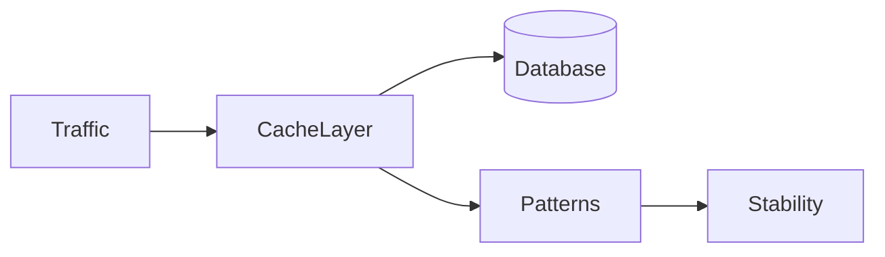

# Lesson 3: Cache Patterns (Long-form Enhanced)

> Production caching is about failure modes: stampedes, slow Redis, evictions, and per-instance divergence. This lesson focuses on patterns that keep systems stable under real traffic.

## Table of Contents

- Stampede prevention (locks + jitter)
- Cache-aside fallbacks (Redis down)
- Multi-level caching (L1 + L2)
- Common pitfalls (deadlocks, infinite retries, stale L1)
- Best practices, pitfalls, troubleshooting
- Advanced patterns (preview): circuit breakers, rate limiting, bounded retries

## Learning Objectives

By the end of this lesson, you will be able to:
- Recognize common cache failure modes and apply patterns to mitigate them
- Prevent cache stampedes using per-key locking (single flight) and TTL jitter
- Design cache-aside fallbacks for resilience when Redis is down
- Implement multi-level caching (L1 in-memory + L2 Redis) safely
- Avoid common pitfalls (deadlocks, infinite retries, stale L1 caches)

## Why Patterns Matter

Production caching is less about “set/get” and more about handling real-world failure modes:
- hot keys expiring together
- Redis latency spikes
- evictions causing miss storms
- per-instance caches diverging

Patterns provide battle-tested approaches to keep systems stable.



## Cache Stampede Prevention (Per-Key Lock)

Idea:
- allow one request to rebuild a missing key
- others wait briefly and retry

```typescript
async function getWithLock(key: string) {
  const lockKey = `lock:${key}`;
  const lock = await client.set(lockKey, "1", { EX: 10, NX: true });

  if (!lock) {
    // Wait and retry (bounded retries in real code)
    await new Promise((resolve) => setTimeout(resolve, 100));
    return getWithLock(key);
  }

  try {
    return await fetchAndCache(key);
  } finally {
    await client.del(lockKey);
  }
}
```

### Production hardening notes

- bound retries to avoid infinite recursion
- use lock TTL to avoid deadlocks
- add jitter to retry delay

## Cache-Aside with Fallback (Redis Down)

```typescript
async function getWithFallback(key: string) {
  try {
    return await cache.get(key);
  } catch (error) {
    console.error("Cache error, using database", error);
    return await database.get(key);
  }
}
```

### Why this matters

For typical caching, Redis should not be a single point of failure:
- if cache is down, you prefer “slower but correct” over “down”.

## Multi-Level Cache (L1 + L2)

L1: in-memory (fastest, per-instance)  
L2: Redis (shared, still fast)

```typescript
async function getMultiLevel(key: string) {
  // L1
  if (l1Cache.has(key)) return l1Cache.get(key);

  // L2
  const l2Value = await redis.get(key);
  if (l2Value) {
    l1Cache.set(key, l2Value);
    return l2Value;
  }

  // Source of truth
  const value = await fetchFromSource(key);
  l1Cache.set(key, value);
  await redis.set(key, value);
  return value;
}
```

### Multi-level caveats

- L1 must be bounded (TTL/eviction), or it becomes a memory leak
- L1 can serve stale data if you don’t invalidate it on writes

## TTL Jitter (Stampede Mitigation)

Even without locks, adding TTL jitter spreads expirations:
- base TTL ± random jitter

This reduces synchronized expiration events.

## Real-World Scenario: Hot Homepage Endpoint

Homepage endpoints often:
- are hit frequently
- are expensive to compute

Use:
- multi-level cache for ultra-fast L1 hits
- per-key locks to prevent stampedes
- fallbacks to DB when Redis is degraded

## Best Practices

### 1) Prefer bounded patterns

Bound:
- retries
- lock durations
- L1 cache size and TTLs

### 2) Keep fallbacks safe

Fallbacks should protect DB from overload. Consider:
- rate limiting
- circuit breakers
- returning cached stale values (advanced)

### 3) Measure and alert

Monitor:
- Redis latency and errors
- DB load during cache degradation
- eviction rate

## Common Pitfalls and Solutions

### Pitfall 1: Infinite retries in stampede logic

**Problem:** recursion never ends under heavy load.

**Solution:** cap retries and fail gracefully (fallback).

### Pitfall 2: Lock deadlocks

**Problem:** lock never released.

**Solution:** lock TTL + `finally` cleanup + careful error handling.

### Pitfall 3: L1 cache serves stale data

**Problem:** L1 doesn’t know when DB/Redis changed.

**Solution:** add TTLs to L1 and invalidate L1 on write operations.

## Troubleshooting

### Issue: DB spikes when cache is unhealthy

**Symptoms:**
- Redis timeouts correlate with DB saturation

**Solutions:**
1. Add fallbacks that are rate-limited or circuit-broken.
2. Reduce dependency on cache for critical flows.
3. Add stampede protection and TTL jitter.

## Advanced Patterns (Preview)

### 1) Circuit breakers

If Redis errors spike, temporarily stop using cache and fall back (fail open) so you don’t amplify the outage.

### 2) Bounded retries

Never retry indefinitely. Bound retries with jitter and timeouts to avoid self-inflicted load storms.

### 3) Rate limiting on fallback paths

When cache is unhealthy, DB is at risk. Rate-limit or shed load on fallback paths to protect your source of truth.

## Next Steps

Now that you understand production cache patterns:

1. ✅ **Practice**: Add per-key locking for one hot key family
2. ✅ **Experiment**: Implement L1+L2 cache with bounded L1 TTL and size
3. 📖 **Next**: Finish caching course and proceed to error tracking lessons
4. 💻 **Complete Exercises**: Work through [Exercises 06](./exercises-06.md)

## Additional Resources

- [Redis: Caching patterns](https://redis.io/docs/latest/develop/use/patterns/)

---

**Key Takeaways:**
- Production caching needs patterns for stampedes, outages, and multi-level caching.
- Use per-key locks and TTL jitter to reduce miss storms.
- Always bound retries/locks/L1 caches to avoid turning mitigations into incidents.
